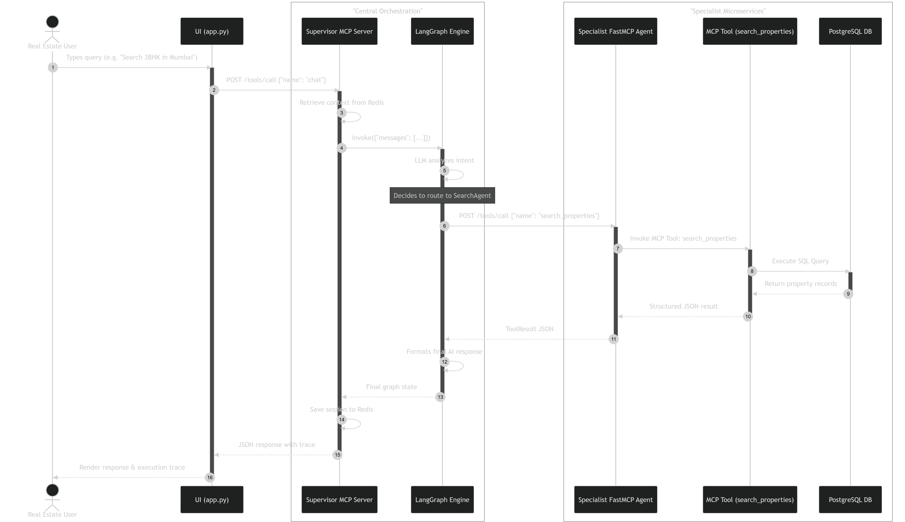

# PropTech Realty AI - Comprehensive System Architecture

## 1. Project Overview

PropTech Realty AI is an advanced, multi-agent AI system designed specifically for the real estate industry. It serves as a unified platform where buyers, sellers, real estate agents, managers, and system administrators can interact with specialized AI assistants to handle all aspects of real estate transactions.

**The Problem it Solves:**
Traditional real estate platforms are static and require users to manually navigate through complex search filters, legal documents, appointment scheduling, and market analytics. This project solves this by introducing a conversational, AI-driven interface where users can simply state their needs in natural language, and the system intelligently routes the request to the correct domain expert (e.g., viewing scheduling, document compliance, or property search).

**Why a Multi-Agent Architecture?**
Real estate encompasses vast, distinct domains (legal, sales, analytics, appointment setting). A single foundational model prompted with all these responsibilities would suffer from context bloat, hallucination, and degraded performance. By using a **Multi-Agent Architecture**, we decompose the responsibilities into narrow, specialized agents. Each agent has its own specific system prompt, access to its own narrow set of tools, and operates independently, coordinated by a central Orchestrator (Supervisor).

**Role of Major Components:**

- **Streamlit UI:** The front-end interface handling authentication, role-based access control (RBAC), and chat interactions.
- **Supervisor Orchestrator:** The central brain built with LangGraph that receives user messages and routes them to the correct specialist agent.
- **Specialist Agents (MCP Servers):** Individual microservices that execute domain-specific tools (e.g., querying the DB, performing analytics).
- **PostgreSQL Database:** The persistent storage layer holding listings, users, offers, viewings, and market data.
- **Redis Memory Store:** Handles scalable, persistent conversation history and session management across thread IDs.

---

## 1.1. PropTech Realty AI - Demo

[](https://www.youtube.com/watch?v=bSASzMztjEQ)

---

## 2. High Level Architecture

The architecture represents a decoupled, microservices-based approach using the **Model Context Protocol (MCP)** and **LangGraph**. The UI never talks directly to the database or the specialist agents. Instead, the UI talks to the Supervisor's MCP server, which in turn orchestrates requests to the specialist MCP servers.


### Diagram Step-by-Step

1. **User Interaction:** The user interacts with the `StreamlitUI`, sending a chat message.
2. **Supervisor Invocation:** The UI sends an MCP request (triggering the `chat` tool) to the `SupervisorMCP` over HTTP port 9001.
3. **Orchestration:** The request enters the `LangGraph` state machine. The graph uses an LLM to determine the user's intent and selects the correct routing path.
4. **Delegation:** The graph forwards the context to one of the 7 connected Specialist MCP Servers (Ports 8001-8007) or handles it in the embedded general node.
5. **Tool Execution & DB:** The selected specialist executes its specific tools, querying the `PostgreSQL` database.
6. **Return Data:** The result flows back through the graph to the Supervisor, and finally to the Streamlit UI.

---

## 3. Multi-Agent System Explanation

The multi-agent system comprises 8 intelligent entities: 1 Orchestrator (Supervisor), 7 Specialist Agents, and 1 Embedded Direct Answering Agent.

### Agent Orchestration Logic

The system uses a **Supervisor Router Model**. The Orchestrator receives the conversation state and must output exactly one routing token (e.g., `transfer_to_listing`, `transfer_to_analytics`). LangGraph conditional edges intercept this token and map the state execution to the corresponding localized agent node. Once the designated agent completes its tool execution and generates a response, the state proceeds unconditionally to the `END` node, terminating the subgraph and returning to the user.

### List of Agents

#### 1. Supervisor Agent (Orchestrator)

- **Purpose:** Analyze intent and delegate the task.
- **Inputs:** Chat history and latest user message.
- **Internal Logic:** Analyzes the keywords (deterministic fallback) and utilizes an LLM to accurately select a target transfer tool.
- **Communication:** Connects via `MultiServerMCPClient` to downstream agents.

#### 2. Property Listing Agent

- **Purpose:** Manage the lifecycle of property listings.
- **Tools:** Create listing, update status, delist.
- **Internal Logic:** Direct mapping to SQL queries modifying the `properties` table.

#### 3. Client & Lead Agent

- **Purpose:** Manage users (buyers/sellers) and CRM lead pipelines.
- **Tools:** Register client, log CRM interactions, email follow-ups.

#### 4. Property Search Agent

- **Purpose:** Execute complex multi-filter database searches.
- **Tools:** Search by price/location, find nearby properties, recommend matching listings.

#### 5. Viewing & Appointment Agent

- **Purpose:** Calendar management and physical appointments.
- **Tools:** Schedule viewing, reschedule, cancel, log feedback (1-5 ratings).

#### 6. Offer & Deal Agent

- **Purpose:** Handle negotiations and pipeline tracking.
- **Tools:** Submit offer, counteroffer, accept offer, view deal statistics. Updates the `offers` and `deals` tables.

#### 7. Document & Legal Agent

- **Purpose:** Track KYC and document compliance.
- **Tools:** Document checklist generation, status verification, compliance audit.

#### 8. Market Analytics Agent

- **Purpose:** Perform data science and financial calculations.
- **Tools:** Rental yield calculation, price trending, ROI, comparable sales analysis.

#### 9. Direct Answering Agent

- **Purpose:** Answer general real estate educational queries directly (e.g., "What is a sale deed?"). Contains no external tools to prevent hallucinating database functions.

---

## 4. MCP Server Deep Explanation

**Model Context Protocol (MCP)** is an open standard that allows AI models to securely interface with local and remote data sources and compute tools. This project utilizes the **FastMCP** implementation.

**Why MCP is Used:** Instead of statically importing hundreds of Python functions into a monolithic AI server, MCP allows each agent microservice to expose its own specific tools over HTTP. The Supervisor dynamically discovers and consumes these tools independently, promoting strict separation of concerns.

### Server Structure and Tool Registration

Each agent executes its own FastMCP instance. For example, `listing_server.py` defines a FastMCP server that explicitly decorates localized functions with `@mcp.tool()`.

### Sequence Diagram: MCP Execution Lifecycle



### Step Explanations:

1. **Tool Exposure:** The Supervisor exposes a meta-tool named `chat`. Streamlit invokes this tool via an HTTP JSON-RPC POST.
2. **Graph Initiation:** Inside the `chat` tool function, `LangGraph.ainvoke()` is called.
3. **MCP Tool Call:** During graph execution, the selected Agent (which is registered as a MultiServer MCP node) receives an HTTP JSON-RPC request for its specific tool (e.g., `search_properties`).
4. **Data Exchange Formulation:** Data is exchanged entirely as JSON over `streamable-http`. The graph interprets the JSON response, translates it to a `ToolMessage`, and passes it back to the LLM to formulate the `AIMessage`.

---

## 5. Code Walkthrough (Step-by-Step)

### `ui/pages.py`, `ui/components.py`, `ui/api.py`

- **What it does:** Constitutes the modularized Streamlit frontend code.
- **Key Logic:** `pages.py` defines the main `_chat_page` and `_login_page`. `api.py` contains the HTTP client logic (`_mcp_call`) to interact with the Supervisor. `components.py` handles rendering the sidebar, agent quick-actions, and the expanding architectural "Trace" visualizer.
- **Connection:** It connects users visually to the backend, transforming user inputs into structured JSON payloads sent to port 9001.

### `app.py`

- **What it does:** The primary entry point for the Streamlit UI.
- **Key Logic:** Reduced to a concise routing mechanism. It initializes the database connection, configures the page layout, and routes between login and authenticated states by importing from the `ui/` package.

### `database/db.py`

- **What it does:** Handles the PostgreSQL schema definition and seed data initialization.
- **Key Logic:** Contains the `init_db()` function, establishing 11 interconnected relational tables (e.g., `users`, `properties`, `viewings`, `deals`) and populating them with mock data for the demo environment.

### `supervisor/supervisor_server.py`

- **What it does:** The FastMCP server acting as the ingress for Streamlit.
- **Key Logic:** Exposes tools like `chat`, `list_sessions`, and `get_session`. It integrates heavily with `utils/redis_memory.py` to restore chat history from Redis, appending the retrieved context to the incoming request before triggering the graph execution.

### `supervisor/graph.py`

- **What it does:** The core LangGraph state machine.
- **Key Logic:**
  - Iterates over `SPECIALIST_SERVERS` and uses `MultiServerMCPClient` to dynamically ingest all downstream tools.
  - Implements `create_react_agent` for each specialist.
  - Contains deterministic NLP fallbacks (`_fallback_transfer_name`) alongside LLM-based routing logic ensuring resilient traffic direction.

### `mcp_servers/*.py` (e.g., `search_server.py`)

- **What it does:** The individual microservices.
- **Key Logic:** Standalone Python scripts. `search_server.py` defines `FastMCP` and exposes SQL-backed functions like `search_properties_db` wrapped in `@mcp.tool()`.

### `utils/redis_memory.py`

- **What it does:** Manages persistent conversation scope.
- **Key Logic:** Implements `RedisConversationStore`. Capable of transparently swapping in and out context, performing connection pings, and utilizing an LLM (`_summariser_llm`) to compact and summarize long conversation arrays to prevent context window overflow.

### `start_servers.py`

- **What it does:** System startup manager.
- **Key Logic:** Uses `subprocess` and `psutil` to systematically boot up all 7 specialist agents, map them to log files, wait for them to bind to ports, and finally boots the Supervisor agent.

---

## 6. Execution Flow (Full Runtime Flow)

When a user typed: _"What offers do I have on my apartment in Bandra?"_

1. **User Action:** Submits string in `st.chat_input` in Streamlit.
2. **API Request:** Streamlit calls `ui/api.py:_call_supervisor()` which sends a POST request to HTTP port 9001.
3. **Session Management:** `supervisor_server.py` locates the thread ID in Redis, retrieves past message arrays, appends the new text, and calls `graph.ainvoke()`.
4. **Orchestrator Selection:** The `supervisor` node in LangGraph evaluates the text. Recognizing "offers", it issues a tool call for `transfer_to_offer`.
5. **Graph Edge Transition:** The dynamic edge router reads the tool call and shifts execution state to the `offer_agent` node.
6. **Agent Execution:** The Offer Agent LLM analyzes the request and realizes it needs database data. It initiates the `offer_history` tool.
7. **MCP Forwarding:** FastMCP intercepts this internal tool requirement and fires POST 8005/mcp to the `offer_server.py` microservice.
8. **DB Query:** The local microservice queries Postgres, returning JSON representation of the user's active offers.
9. **Finalization:** The Offer Agent LLM formats the array into readable markdown. The state reaches `END`.
10. **UI Update:** The Supervisor returns the localized message and the trace metadata to Streamlit, which reveals the internal pathway and the final message to the user.

---

## 7. How to Run the Project (Step-by-Step)

### Step 1: Environment Setup

Ensure you have Python 3.10+ installed.

```bash
# Clone the repository and navigate to the root directory
cd Real-Estate-System-Agent

# Create and activate a virtual environment
python -m venv .venv
# On Windows:
.venv\Scripts\activate
# On macOS/Linux:
source .venv/bin/activate

# Install all requisite dependencies
pip install -r requirements.txt
```

### Step 2: Database and Environment Files

- Ensure you have **PostgreSQL** running locally on port 5432 (or modify `.env`).
- Ensure you have **Redis** running locally on port 6379 natively or via Docker (or Memurai on Windows).
- Copy `.env.example` to `.env` and fill out `OPENAI_API_KEY`.

### Step 3: Start the Backend Agents (MCP Servers)

You must initialize all background microservices before querying.

```bash
# This script boots the 7 specialist servers natively, assigns ports,
# creates log files, and starts the supervisor.
python start_servers.py
```

_Wait until the script outputs: "🏠 PropTech Realty AI — All servers running!"_

### Step 4: Run the UI Application

Open a **new terminal tab** (keep the servers running in the original terminal). Activate your environment again and start Streamlit.

```bash
streamlit run app.py
```

The application will launch in your browser at `http://localhost:8501`.

---

## 8. Folder Structure Explanation

```text
Real-Estate-System-Agent/
│
├── database/            # Contains db.py for PostgreSQL schema modeling and seeding
├── logs/                # Automatically generated dir holding stdout/stderr logs of agents
├── mcp_servers/         # Microservices cluster; contains 7 identical Python scripts exposing FastMCP tool clusters
├── supervisor/          # Orchestration brains: contains graph.py (LangGraph) and supervisor_server.py (MCP Gateway)
├── ui/                  # Clean Streamlit components grouped by function (styles, pages, components, api, constants)
├── utils/               # Common utilities: RBAC logic (auth.py) and context management (redis_memory.py)
├── .env                 # Environment configuration (Keys, DB URIs)
├── app.py               # The main entrypoint for Streamlit UI
├── requirements.txt     # Python dependency registry
└── start_servers.py     # Subprocess manager for handling backend multi-agent startup and graceful shutdowns
```

---

## 9. Advanced Technical Explanation

**Concurrency and Async Execution:**
The underlying FastMCP implementation utilizes `asyncio` natively. The `MultiServerMCPClient` uses asynchronous JSON-RPC to poll and invoke tools on downstream agents simultaneously if required. LangGraph evaluates edge routing asynchronously (`ainvoke`), completely non-blocking the asyncio loop, which is vital when fielding parallel multi-client traffic.

**Memory Scaling with Redis & Compaction:**
As conversation graphs grow, LLM context windows exceed their token limits, spiking API costs and causing OOM timeouts. The `utils/redis_memory.py` service gracefully captures thread states, maintaining a history. If the context breaches `REDIS_TEXT_LIMIT`, it engages `_summariser_llm()` to permanently "compress" the oldest message chunk into a synthesized summary text block while maintaining exact factual continuity for IDs, preferences, and locations.

**Decoupled Microservice Scaling:**
Because the architecture uses standard HTTP to marshal tools (MCP Protocol), each agent acts mathematically as a decoupled compute node. If the `SearchAgent` becomes bottlenecked due to massive database queries, it is architecturally feasible to deploy 10 instances of `search_server.py` behind a standard HTTP load balancer, and the Supervisor graph would organically distribute load. The UI relies strictly on the Supervisor Port, isolating client interfaces from backend compute topologies.

---

## 10. Final Summary

The **PropTech Realty AI** platform successfully bridges standard web app frameworks (Streamlit) with advanced multi-agent orchestrations. By anchoring the foundation on **LangGraph** (for deterministic state management and conditional node routing) and **MCP** (to federate capabilities securely across HTTP boundaries), the system isolates operational logic gracefully.

**Key Design Decisions:**

- Utilizing an embedded General Knowledge node reduces network latency and processing overhead for mundane FAQ requests that don't require database lookups.
- Implementing the "Supervisor Route Pattern" circumvents standard AI hallucination by creating rigid "domain fences" where Specialist Agents literally do not possess the digital tools to answer out-of-bounds questions, forcing deep, accurate specialty execution.
- Refactoring the UI into distinct Python packages ensures the frontend codebase remains scalable and highly legible.

The result is a fast, maintainable, and highly extensible framework that feels fluid to the end-user while providing enterprise-grade traceability and auditability on the backend.
